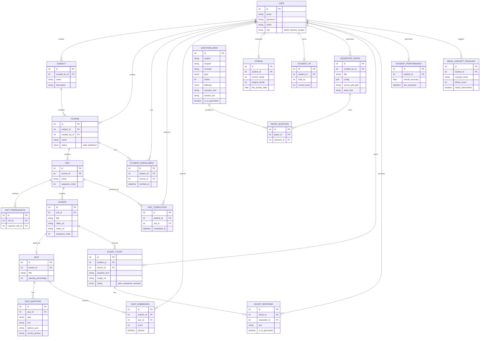

# Envirr v2: Database Schema & Entity-Relationship (ER) Diagram

To perfectly capture the flow of data mapping to our Django backend, the schema is organized into 5 logical Domains (Django Apps). This ensures our code remains modular and extremely scalable.

## Entity-Relationship (ER) Diagram

## Django Model Breakdown (The 5 Apps)

### 1. `users` App
*The foundation mapping Role-Based Control.*
- **CustomUser**: Extends standard security. Defines if an account is a `Student`, `Teacher`, or `Admin`.

### 2. `courses` App
*The Content Hierarchy mapped to relational strictness.*
- **Subject**: Broad topic (e.g. "Science").
- **Course**: The track targeting a grade, pointing to a Subject.
- **Unit**: Clusters of lessons.
- **UnitPrerequisite**: A self-referential map to track interlocking logic (e.g., Unit B cannot unlock until Unit A is passed).
- **Lesson & Quiz**: The actual checkpoint gate restricting progression.

### 3. `activity` App (Enrollments)
*Tracks exact movement of students through the LMS.*
- **StudentEnrollment**: Which Course a Student claims.
- **UnitCompletion**: Written only when all underlying lesson quizzes pass.
- **QuizSubmission**: The actual pass/fail tracker driving XP triggers.

### 4. `gamification` App
*Separated logically to prevent heavy traffic collisions with course reads.*
- **Streak**: Tracks the current sequential days.
  - *Fix*: Anchored to the `date` field explicitly (e.g., `YYYY-MM-DD`). Comparing pure Dates solves the sliding 24-hour window bug.
- **StudentXP**: The global ledger of their points and level mapping.

### 5. `ai_engine` App
*The heavyweight integration solving Bank Seeding, PDFs, and Doubts.*
- **QuestionBank**: Centralized pool.
- **GeneratedPaper**: Holds the `secure_pdf_path`. Generation runs asynchronously via **Celery Workers**.
- **PaperQuestion (Many-to-Many)**: A bridge table mapping `GeneratedPaper` <> `QuestionBank`. 
- **DoubtTicket & DoubtResponse**: Processing bound to Celery image analysis. AI Responses are cached heavily in **Redis** before querying the LLM to save token costs.

### 6. `analytics` App (The AI Tutor Brain)
*Harvesting the goldmine of quiz data.*
- **StudentPerformance**: Aggregated macro-level statistics per student.
- **WeakConceptTracking**: Maps exactly which concept vectors the student fails. Actively triggers pop-up intervention guides ("You're struggling with X, revise Lesson Y").
